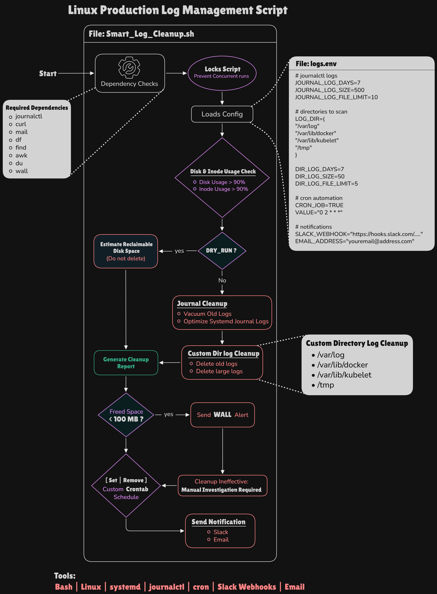

# Linux Production Log Cleanup Automation (Bash)

## Architectural Diagram



## Overview

This project provides a production-style **Bash automation script** that detects and resolves **disk pressure caused by uncontrolled log growth** on Linux servers.

Production systems often face disk exhaustion due to:

- Application logs growing indefinitely
- Container logs from Docker or Kubernetes nodes
- Systemd journal logs
- Temporary files accumulating over time

When disks reach **100% capacity**, systems may fail to:

- Write logs
- Create files
- Start services
- Schedule containers

This script automatically detects high disk usage and performs **safe log cleanup operations**, while providing alerts and notifications.

---

# Key Features

- Detects **disk usage > 90%**
- Detects **inode exhaustion**
- Cleans **systemd journal logs**
- Cleans logs in configurable directories
- Supports **dry-run simulation mode**
- Prevents concurrent execution using a **lock file**
- Sends alerts using **wall**
- Sends **Slack notifications**
- Sends **email reports**
- Supports **cron automation**
- Logs execution output to `/var/log/disk_cleanup.log`

---

# Architecture Flow

1. Dependency validation
2. Script locking
3. Load configuration
4. Disk and inode usage checks
5. Dry-run simulation (optional)
6. Journal log cleanup
7. Custom directory log cleanup
8. Cleanup report generation
9. Effectiveness validation
10. Alerting if cleanup insufficient
11. Cron automation
12. Slack & email notifications

---

# Script Safety Settings

The script runs with strict Bash modes:

```
set -o errexit
set -o pipefail
set -o nounset
```

These ensure:

- Script exits on errors
- Pipeline failures are not ignored
- Undefined variables are not allowed

---

# Logging

All script output is written to:

```
/var/log/disk_cleanup.log
```

Implemented using:

```
LOG_FILE="/var/log/disk_cleanup.log"
exec >> "$LOG_FILE" 2>&1
```

Explanation:

| Command      | Purpose                      |
| ------------ | ---------------------------- |
| exec >> file | Redirect stdout to file      |
| 2>&1         | Redirect stderr to same file |

---

# Configuration File

The script loads configuration from:

```
logs.env
```

Example:

```
# journalctl logs
JOURNAL_LOG_DAYS=7
JOURNAL_LOG_SIZE=500
JOURNAL_LOG_FILE_LIMIT=10

# directories to scan
LOG_DIR=(
"/var/log"
"/var/lib/docker"
"/var/lib/kubelet"
"/tmp"
)

DIR_LOG_DAYS=7
DIR_LOG_SIZE=50
DIR_LOG_FILE_LIMIT=5

# cron automation
CRON_JOB=TRUE
VALUE="0 2 * * *"

# notifications
SLACK_WEBHOOK="https://hooks.slack.com/services/..."
EMAIL_ADDRESS="youremail@example.com"
```

---

# Dependency Checks

Required utilities:

```
journalctl
curl
mail
df
find
awk
du
wall
```

Example validation command:

```
command -v journalctl >/dev/null 2>&1
```

---

# Script Locking

Prevents multiple script executions.

```
LOCK_FILE="/tmp/disk_cleanup.lock"
```

Logic:

```
if [ -f "$LOCK_FILE" ]; then
 echo "Another cleanup process is already running."
 exit 1
fi
```

Lock file removal:

```
trap "rm -f $LOCK_FILE" EXIT
```

---

# Disk Usage Check

Command used:

```
df -P / | awk 'NR==2 {print $5}' | tr -d '%'
```

Explanation:

| Tool | Purpose                   |
| ---- | ------------------------- |
| df   | shows filesystem usage    |
| awk  | extracts usage column     |
| tr   | removes percentage symbol |

---

# Inode Usage Check

Inodes represent file capacity on a filesystem.

Command used:

```
df -i /
```

If inode usage exceeds 90%, an alert is sent:

```
wall "WARNING: Inode usage exceeded 90%"
```

---

# Dry Run Mode

Simulates cleanup without deleting files.

Example:

```
DRY_RUN=true ./Smart_Log_Cleanup.sh
```

---

# Journal Log Cleanup

Systemd logs cleaned using:

```
journalctl --vacuum-time=7d
journalctl --vacuum-size=500M
journalctl --vacuum-files=10
```

These remove older logs safely.

---

# Directory Log Cleanup

Directories scanned:

```
/var/log
/var/lib/docker
/var/lib/kubelet
/tmp
```

Find old files:

```
find /var/log -type f -mtime +7
```

Calculate size:

```
du -m file.log
```

Delete file:

```
rm -f file.log
```

---

# Cleanup Report

Script generates a report showing:

- files removed
- total disk space freed
- cleanup actions performed

---

# Cleanup Effectiveness Check

If freed space is less than **100 MB**, manual intervention may be required.

Example logic:

```
if [ "$TOTAL_FREED" -lt 100 ]
```

---

# Cron Automation

Example schedule:

```
0 2 * * *
```

Runs the script every day at **02:00 AM**.

Commands used:

```
crontab -l
crontab -
```

---

# Slack Notifications

Sent using webhook:

```
curl -X POST -H 'Content-type: application/json'
```

Example:

```
curl -X POST -H 'Content-type: application/json' --data '{"text":"Log cleanup completed"}' "$SLACK_WEBHOOK"
```

---

# Email Notifications

Example command:

```
echo "Cleanup completed" | mail -s "Log Cleanup Report" admin@example.com
```

---

# Example Usage

Simulation:

```
DRY_RUN=true ./Smart_Log_Cleanup.sh
```

Actual cleanup:

```
DRY_RUN=false ./Smart_Log_Cleanup.sh
```

---

# DevOps Concepts Demonstrated

This project demonstrates:

- Linux system administration
- Bash automation
- Log lifecycle management
- Incident prevention
- Disk pressure remediation
- Monitoring & alerting
- Safe scripting practices

---

# Use Cases

This script is useful for:

- Kubernetes worker nodes
- Docker hosts
- CI/CD build servers
- application servers
- logging infrastructure

It helps prevent incidents like:

- disk full
- inode exhaustion
- uncontrolled log growth

---

# Author

DevOps practice project demonstrating **production-grade Linux automation and reliability engineering practices**.
