# Linux Log Cleanup System (Bash) – Safe, Automated & Observable

**⚡ Built with a production mindset — focused on safety, visibility, and automation.**

---

Managing logs on Linux systems sounds simple… until it isn’t.

I built this tool while exploring how real systems behave under pressure — disk filling up, thousands of small log files, and no clear visibility of what cleanup actually does.

This project is not just a script.  
It’s a **safe, automated log management system** designed to:

- Prevent accidental data loss using dry-run mode  
- Clean logs using both time-based and size-based strategies  
- Provide clear summaries of what changed  
- Send alerts (Slack + Email) after execution  
- Run automatically using cron  

The goal was simple:  
- **Build something that behaves like a real production tool, not just a one-time script.**
- **Designed to handle real-world log cleanup scenarios safely, not just ideal cases.**

## 📑 Table of Contents

- **[Overview](#-overview)**
- **[Real-World Focus](#-real-world-focus)**
- **[Architecture & Workflow](#-architecture--workflow)**
- **[Problem & Motivation](#-problem--motivation)**
- **[Solution](#-solution)**
- **[Why Not logrotate?](#️-why-not-logrotate)**
- **[Key Features](#-key-features)**
    - **[Dependency Checks](#1--dependency-checks)**
    - **[Script Lock](#2--script-lock)**
    - **[Configuration (logs.env)](#3-️-configuration-logsenv)**
    - **[Logging Mode](#4--logging-mode)**
    - **[Dry Run & Actual Run](#5--dry-run--actual-run)**
    - **[Cleanup Strategies](#6--cleanup-strategies)**
    - **[Cron Automation](#7-️-cron-automation)**
    - **[Monitoring & Alerts](#8--monitoring--alerts)**
- **[How to Run](#️-how-to-run)**
- **[Challenges & Learnings](#-challenges--learnings)**
- **[Limitations](#️-limitations)**
- **[Future Improvements](#-future-improvements)**
- **[What I Learned](#-what-i-learned)**
- **[Final Words](#-final-words)**
- **[Author](#-author)**

## 🚀 Overview

This project is a **production-style Linux log cleanup tool** written in Bash.

It is designed to safely manage disk space by cleaning up:

- System journal logs (`journalctl`)
- Custom directories (like `/var/log`, Docker logs, temp files)

The script focuses on **safety first**:

- Runs in dry-run mode by default  
- Uses locking to prevent multiple executions  
- Logs all actions  
- Validates dependencies before running  

It also includes **real-world features** like:

- Slack and Email notifications  
- Cron-based automation  
- Disk and inode usage monitoring  

The idea is not just to delete logs — but to **understand, control, and monitor cleanup behavior**.

## 🧪 Real-World Focus

This project was built by testing against real system conditions, including:

- High disk usage scenarios  
- Large numbers of small log files  
- Permission-restricted directories  
- Notification failures and retries  

The goal was to move beyond “it works” and ensure it behaves correctly under pressure.

## 🧠 Architecture & Workflow

The script follows a structured flow, similar to how production maintenance jobs work.


### Flow Summary

1. Load configuration from `logs.env`
2. Perform safety checks:
   - Dependency validation
   - Lock mechanism
   - Disk & inode usage checks
3. Run cleanup:
   - Journal logs (`journalctl`)
   - Custom directory cleanup
4. Generate a detailed summary
5. Send notifications (Slack & Email)
6. Log all activity to file and/or screen

Each step is isolated into functions, making the script easier to maintain and extend.

## 🧩 Problem & Motivation

In real systems, log management becomes messy very quickly.

Some common issues:

- Disk space gets filled without warning  
- Thousands of small files consume space silently  
- Manual cleanup is risky and time-consuming  
- No clear visibility into what will be deleted  
- No alerting after cleanup  

While tools like `logrotate` exist, they don’t always give enough control or visibility.

I wanted to build something that answers questions like:

- *What exactly will be deleted?*  
- *How much space will I actually free?*  
- *Did the cleanup work as expected?*  

That’s where this project started.

## 💡 Solution

This project solves the problem by combining **safety, visibility, and automation**.

Key ideas behind the solution:

- **Dry-run mode by default**  
  → simulate everything before actual deletion  

- **Hybrid cleanup strategy**  
  → handles both large files and many small files  

- **Clear reporting**  
  → shows what will be removed and how much space is freed  

- **Built-in alerting**  
  → Slack + Email notifications after execution  

- **Automation-ready**  
  → integrates with cron for scheduled runs  

- **Production safety features**  
  → lock file, dependency checks, structured logging  

Instead of blindly deleting logs, the script gives you **control and confidence**.

## ⚖️ Why Not logrotate?

`logrotate` is a great tool — and it should definitely be used in production systems.

But while working on this, I noticed some gaps:

- No clear summary of how much space was freed  
- No built-in alerting (Slack / Email)  
- Limited visibility before execution  
- Not flexible for mixed cleanup strategies (age + size + multiple directories)  
- No dry-run mode for safe testing  
- Works primarily on predefined log configurations rather than dynamic multi-source cleanup

This project is not trying to replace `logrotate`.

Instead, it focuses on:

👉 **visibility + safety + flexibility**

You can think of it as a **complementary tool**, especially useful when:

- debugging disk space issues  
- running ad-hoc cleanups  
- monitoring cleanup effectiveness  

## 🎯 Key Features

**Designed with production safety in mind — not just log deletion.**

### 1. 🔍 Dependency Checks
Before doing anything, the script checks if required tools are available (`journalctl`, `curl`, `msmtp`, etc.).

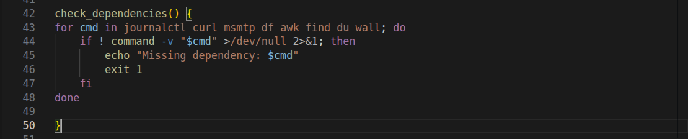

This avoids partial execution and unexpected failures.  
If something is missing, it exits early with a clear message.

---

### 2. 🔒 Script Lock
A lock file is used to make sure only one instance runs at a time.

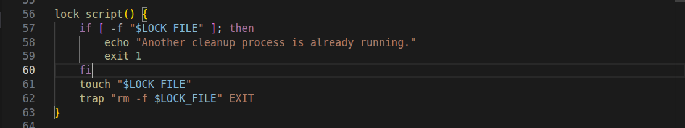

This prevents situations where multiple cleanup processes run together and delete more than expected.

---

### 3. ⚙️ Configuration (logs.env)
All behavior is controlled through a simple `logs.env` file.

This includes:
- directories to scan  
- retention rules (days, size, file count)  
- notification settings  
- cron configuration  

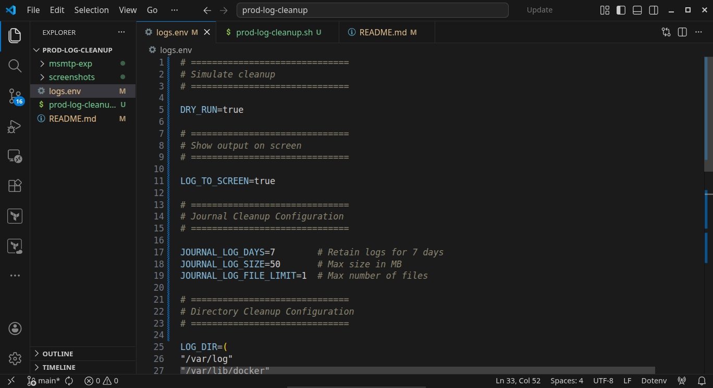

No need to edit the script every time — just update the config.

---

### 4. 📝 Logging Mode
The script supports two logging modes:

- **Screen + File logging** (using `tee`)  
- **File-only logging**  

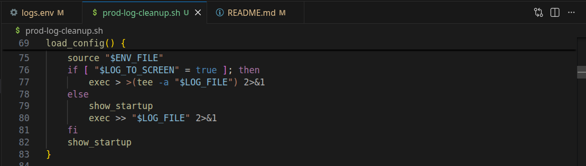

This makes it usable both for:
- manual runs (debugging)  
- automated runs (cron jobs)

---

### 5. 🧪 Dry Run & Actual Run
Runs in **dry-run mode by default**.

- Dry run → shows what *would* be deleted  and how much space *would* be freed
- Actual run → performs the cleanup  

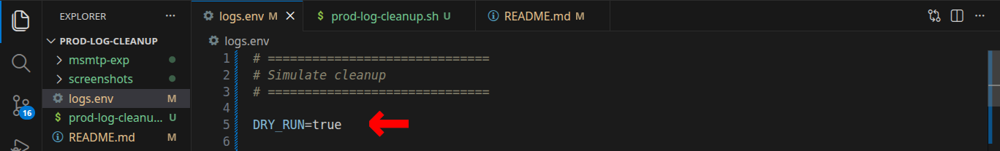

This adds a safety layer before touching real data.

---

### 6. 🧹 Cleanup Strategies
Handles logs in two ways:

- **Journal Cleanup**  
  Uses `journalctl --vacuum-*` for system logs  

  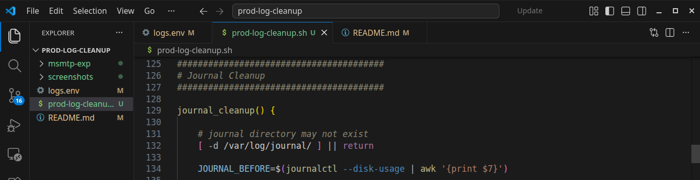

- **Custom Directory Cleanup**  
  Cleans files based on:
  - age (`mtime`)  
  - size  

  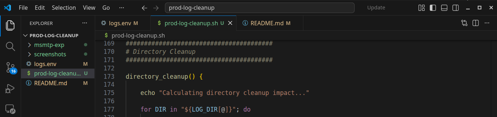

Also avoids touching journal logs while scanning directories.

---

### 7. ⏱️ Cron Automation
The script can automatically register / deregister itself as a cron job on the basis of `logs.env` file.

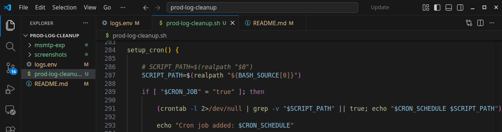

This makes it easy to:
- schedule regular cleanups  
- enable/disable automation from config  

---

### 8. 📊 Monitoring & Alerts

- **Disk Usage Check**  
  Prevents unnecessary runs when disk usage is low  

  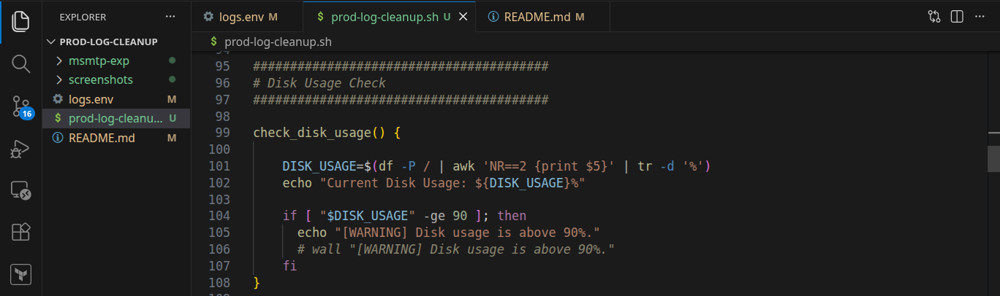

- **Inode Usage Alert**  
  Sends warning when inode usage is high  

  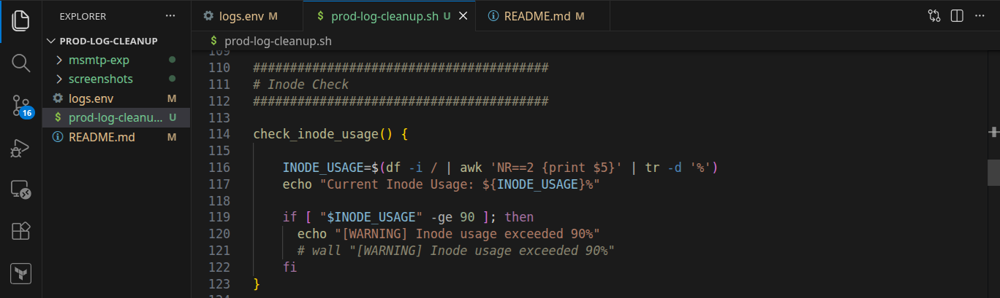

- **Cleanup Effectiveness Check**  
  Alerts if cleanup frees less than expected space  

  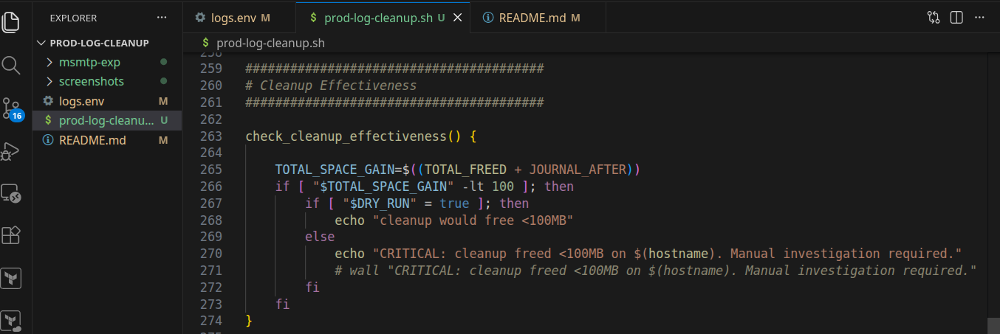

- **Slack Notification**  
  Sends summary after execution  

  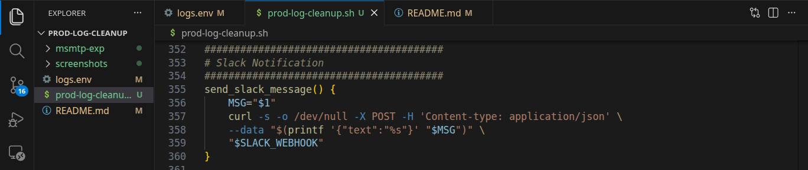

- **Email Notification**  
  Sends formatted report using `msmtp`  

  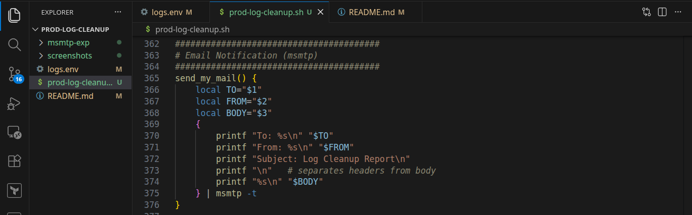 

The script is designed to **avoid surprises**, not just clean logs.

## ▶️ How to Run

### 1. Clone the repository

```bash
git clone https://github.com/sonuparit/prod-log-cleanup.git
cd prod-log-cleanup/
```

### 2. Configure logs.env

Update the configuration file based on your needs:

- directories to scan
- retention rules (days / size)
- Slack webhook (optional)
- Email settings (optional)
- cron schedule

### 3. Run in Dry Run mode (default)
./prod-log-management.sh

This will:
- **simulate the cleanup process**
- **show what will be removed**
- **calculate expected space savings**

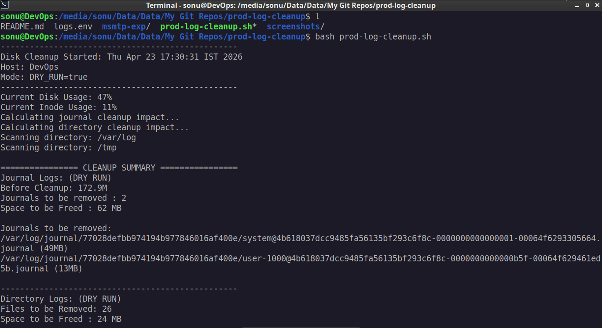 

### 4. Run actual cleanup
DRY_RUN=false ./prod-log-management.sh

This will:

- **delete logs**
- **generate summary**
- **send notifications (if configured)**

### 5. Optional: Enable cron automation

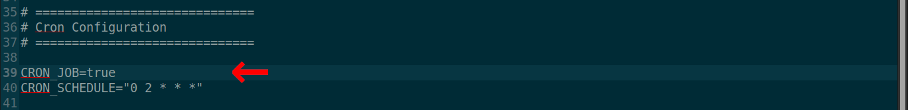 

Set CRON_JOB=true in logs.env, then run:

```
./prod-log-management.sh
```

The script will register itself in cron.

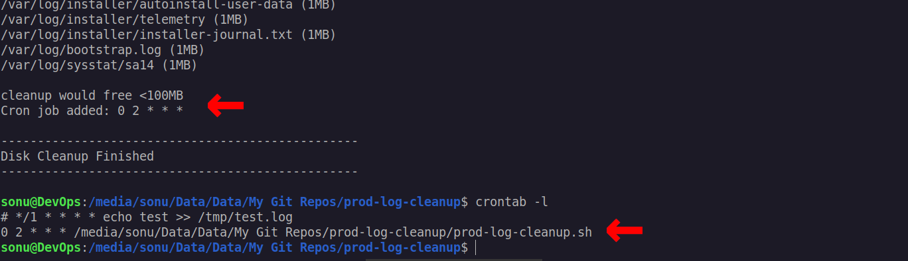 

If `CRON_JOB=false`, then the script will automatically remove itself from cron

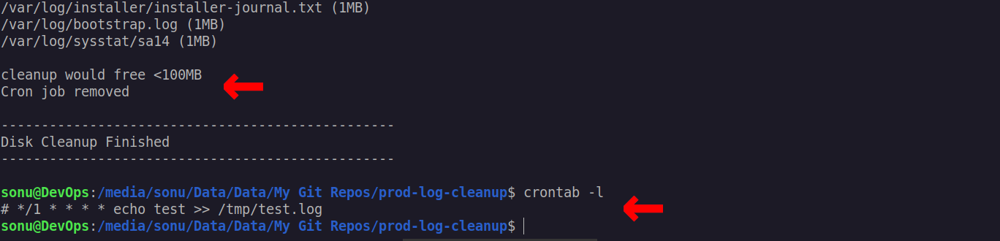 

### 6. 📣 Notifications (Slack & Email)
**Configure Slack Notification (Optional)**

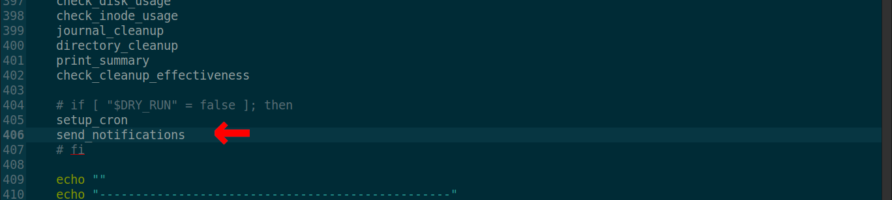 

To enable Slack alerts, add your webhook URL in logs.env:

SLACK_WEBHOOK="https://hooks.slack.com/services/..."

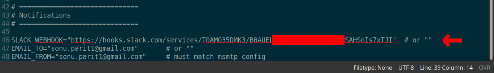 

Once configured, the script will send a summary message after execution.

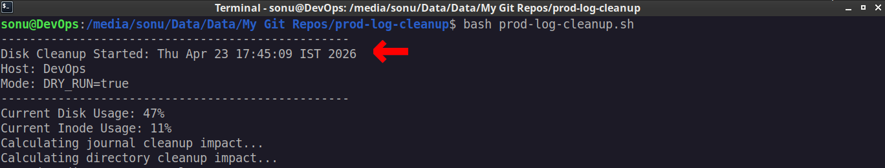 

Watch for the notification

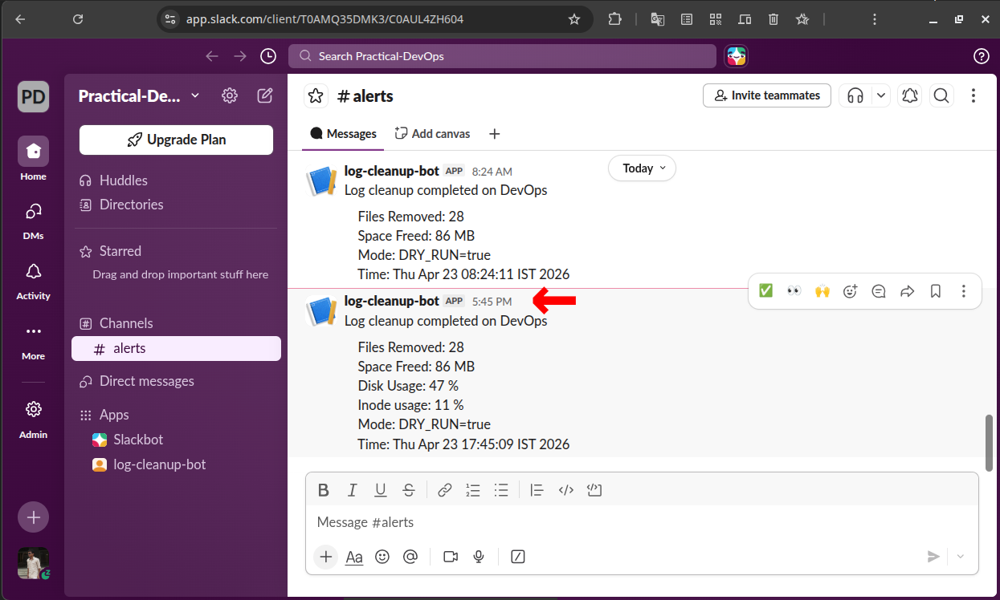 

👉 If not configured, the script will skip Slack notification safely.

7. Configure Email Notification (Optional)

To enable email alerts, configure the following in logs.env:

EMAIL_TO="your@email.com"  
EMAIL_FROM="your@email.com"

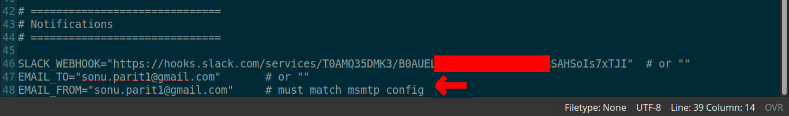 

The script uses msmtp to send a formatted email report.

Make sure:

- msmtp is installed
- SMTP settings are properly configured in your system

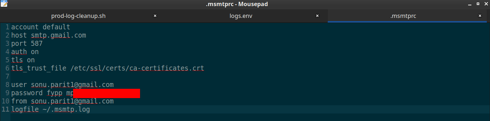 

👉 If email is not configured, the script will skip it without failing.

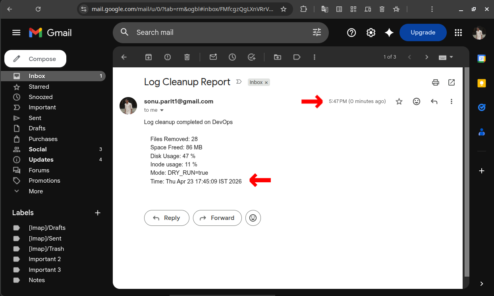 

⚠️ Notes:
- Notifications are triggered automatically after execution. 
- They can work in both dry-run and actual run modes
- Failures in notification do not stop the script

## 🧠 Challenges & Learnings

*While building this, a few real-world challenges came up:*

- **Handling `journalctl` cleanup**\
  It does not expose file-level details, so tracking exact deletions required a different approach.

- **Safe execution design**\
  Adding dry-run mode changed how I structured the script — every destructive action had to be controlled and reversible.

- **Permission issues with logging**  
  - Initially, the script failed because it tried to write logs to **`/var/log`**, which requires root privileges.  
  - I solved this by making the log path dynamic — using **`/var/log`** when running as root and falling back to a user directory otherwise.

- **Setting up email notifications (msmtp)**\
  Configuring **`msmtp`** was not straightforward. I faced issues with **`permissions, configuration, and message formatting`** before getting reliable email delivery working.

These challenges helped me understand that system scripting is not just about writing commands — it’s about handling **`permissions, safety, edge cases, and making the system reliable`**.

**Most of these issues only appeared during real execution, which made this project a practical learning experience rather than just a scripting exercise.**

## ⚠️ Limitations

- `journalctl` does not expose file-level details, so exact journal deletions cannot be tracked
- Space calculation for journal logs is approximate
- The script assumes a Linux environment with required tools installed
- No built-in retry mechanism for failed notifications
- Cron execution depends on system permissions

This tool focuses on **practical usability**, not perfect precision.

## 🚀 Future Improvements

- Add optional backup before deletion (e.g., archive selected logs to S3)
- Store metadata (original path, timestamp) to support easier restoration
- Allow selective backup for critical logs instead of backing up everything
- Integrate with cloud storage for long-term log retention
- Add retry mechanism for Slack / Email notifications
- Introduce log levels (INFO, WARNING, ERROR) for better observability
- Support additional notification channels (Teams, Discord, etc.)
- Convert this into a reusable CLI tool

The goal is to evolve this into a more complete and production-ready system utility,
with better safety, observability, and flexibility.

These improvements would make cleanup safer in environments where log recovery
may be required.

## 💡 What I Learned

This project helped me understand how real systems behave, not just how scripts work.

Some key takeaways:

- Safety matters more than speed (dry-run changed everything)
- Small things like locking and logging make a big difference
- Tools like `journalctl` don’t always give full visibility
- Handling edge cases (permissions, missing tools) is important
- Writing maintainable Bash scripts is harder than it looks

Most importantly, I learned how to think in terms of:

👉 *“What can go wrong in production?”*

## 🧾 Final Words

This started as a simple idea — clean up logs.

But while building it, I realized that real-world systems need more than just deletion:

- they need safety  
- they need visibility  
- they need control  

This project reflects that mindset.

If you’re reading this as a recruiter —  
this is how I approach problems:

👉 understand the system  
👉 think about failure cases  
👉 build something practical and safe  

## 👤 Author

This project was built from scratch as part of my DevOps practice.

It demonstrates how I approach real-world problems — with a focus on reliability, safety, and automation.

Rather than just writing scripts, I aim to design tools that behave like production systems.
